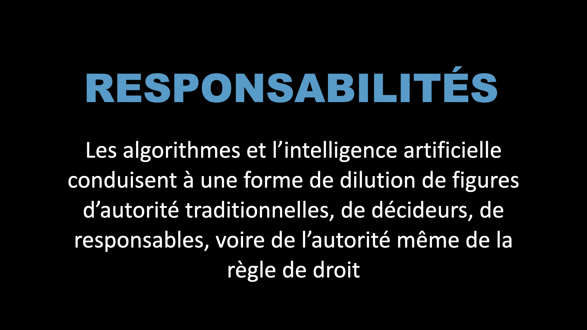

# isp-2025-ia

## Pourquoi est-ce important de parler de l'IA en santé publique ?

**2025-03-20**

##### Intervention lors des journées des internes en santé publique de l'ouest

## pdf

<a href = "docs/isp_intro_ia__brest_2025-03-20_dark.pdf" target="_blank">Accéder à la version pdf de la présentation</a>

## html

<a href = "docs/index.html" target="_blank">Accéder à la version html de la présentation</a>

## Aperçus

